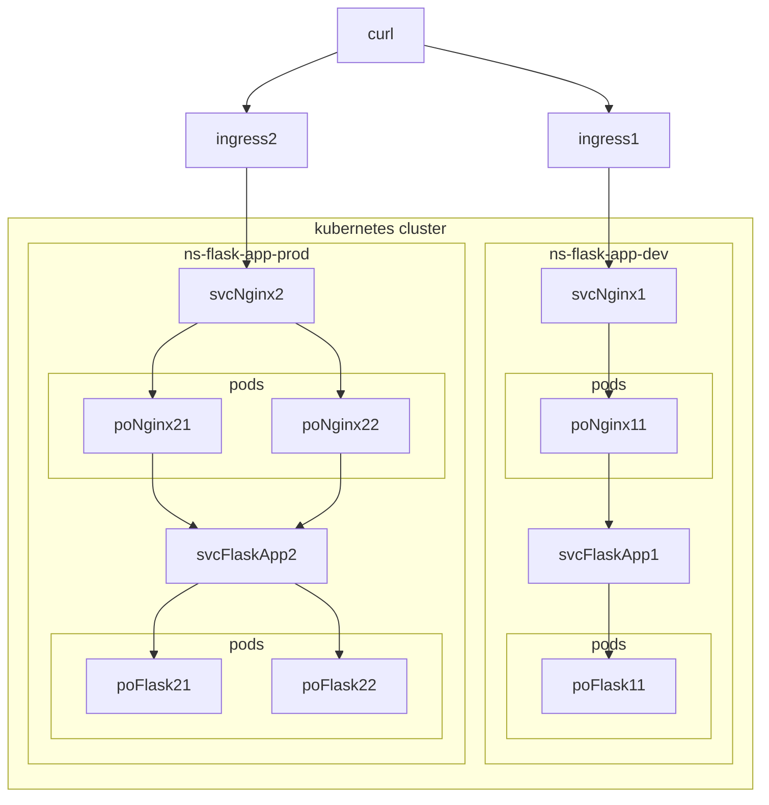

# README

## 構成図



## 手順

```bash
# bash

# 開発環境をデプロイします。
cd kubernetes
kubectl apply -k ./overlays/dev

# 動作確認します。
curl -H "Host: app-dev.example.com" http://localhost/
```

```bash
# bash

# 本番環境をデプロイします。
cd kubernetes
kubectl apply -k ./overlays/prod

# 動作確認します。
curl -H "Host: app-prod.example.com" http://localhost/
```
